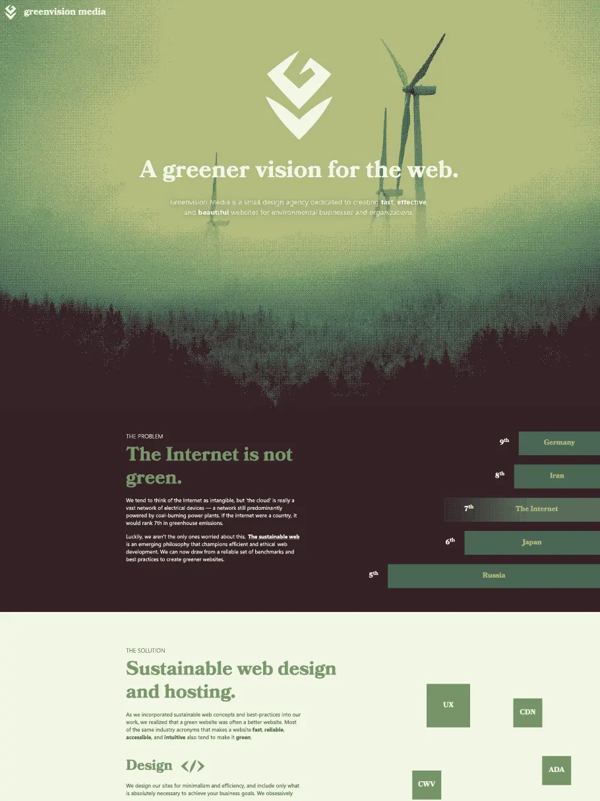
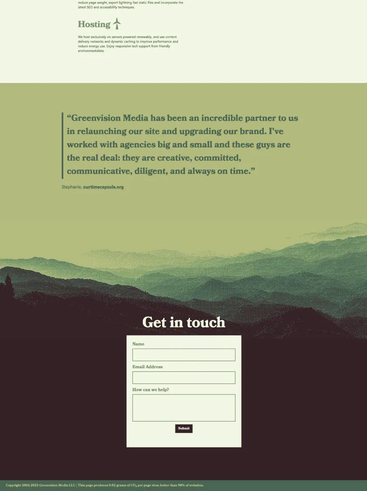
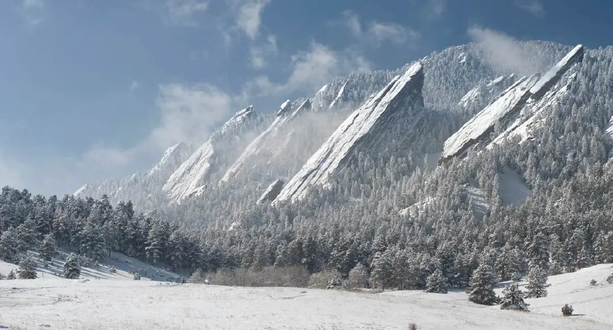
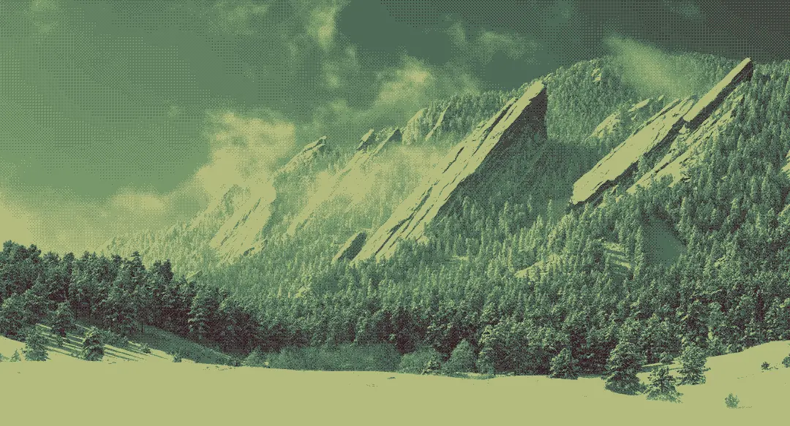
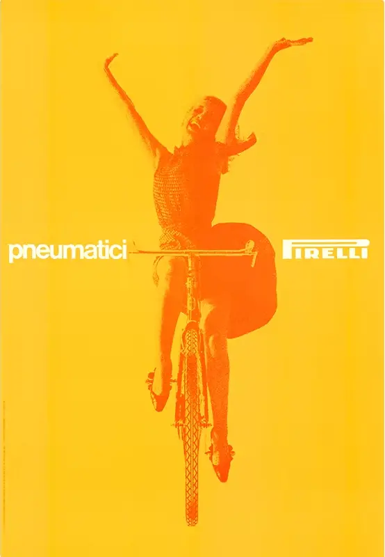
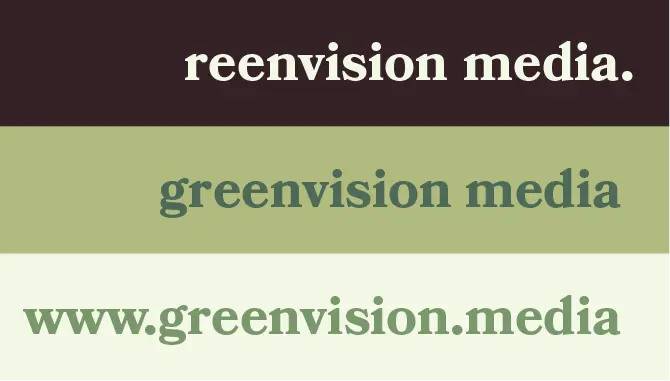
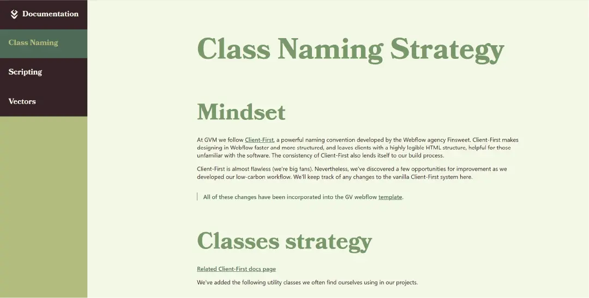

[1]: https://greenvision.media
[2]: https://docs.greenvision.media

# Green Vision Media

Green Vision Media is the small design agency I cofounded with the purpose of
bringing together two of my passions, environmentalism and digital design. We do
this in two ways: by working to help environmental organizations and B-Corps,
and by lowering the carbon footprint of the websites we design.

## Website

If the concept of a website having a carbon footprint seems bizarre or
fascinating to you, look no further than the [GVM website][1]. The
counterintuitive truth is that the internet, though intangible, uses vast
amounts of electricity, and coal. Designers have to acknowledge and address this
challenge.

Imagery is the most energy intensive part of most websites, so maximally
compressing images is key to lowering energy usage. The website makes use of an
obscure and powerful image compression technique called
[dithering](https://wikipedia.org/dithering).

> An image before and after dithering

I find that the resulting patterns are actually quite beautiful. I also realized
that the technique is most effective the fewer colors used, so I settled on a
striking 4-color scheme (which also matches nicely with the name 'green
vision').

> Massimo Vignelli's work was an inspiration for the limited color pallette

> These three color combinations are the basis for the brand

The GVM logo is also designed for efficiency. It's a vector made up of just 20
points, around 1KB total. I designed a few other icons, also with as few points
as possible.

> The GVM logo

With all my optimizations, the GVM website scored in the
[98th percentile](https://www.websitecarbon.com/website/greenvision-media/) of
website carbon footprints.

## Documentation

The techniques I just discussed were terrific design inspiration, but a lot more
goes into making a low-carbon website than just imagery. There are a suite of
strategies, both [new](https://sustainablewebdesign.org/) and
[old](https://stevesouders.com/examples/rules.php) for making a website more
efficient and performant.

I wanted to incorporate these into a set of instructions, that could help me
make websites that were consistantly low-carbon, as well as fast and secure. I
published these as the [GVM documentation][2].

## Chrome Extension

To create websites in this specific style, we use
[Webflow](https://webflow.com), a no-code website builder. NGOs and B-Corps
often need to make rapid changes to a website, but they also usually don't staff
programmers. A no-code tool like Webflow solves this problem by making building
a website simple and easy to learn. But once those edits are made, publishing
sites from Webflow to our specific, renewably powered servers is a far more
complicated process.

> Early capture of the chrome extension, which will add functionality directly
> into Webflow

I wanted to give clients as much freedom over their own website as possible,
which meant that we needed to automate the publishing process. We're in the
process of developing a chrome extension that will do just that. It places a
publish button inside Webflow that will push a client's site straight to a
server powered by wind, solar or hydro. ✦
