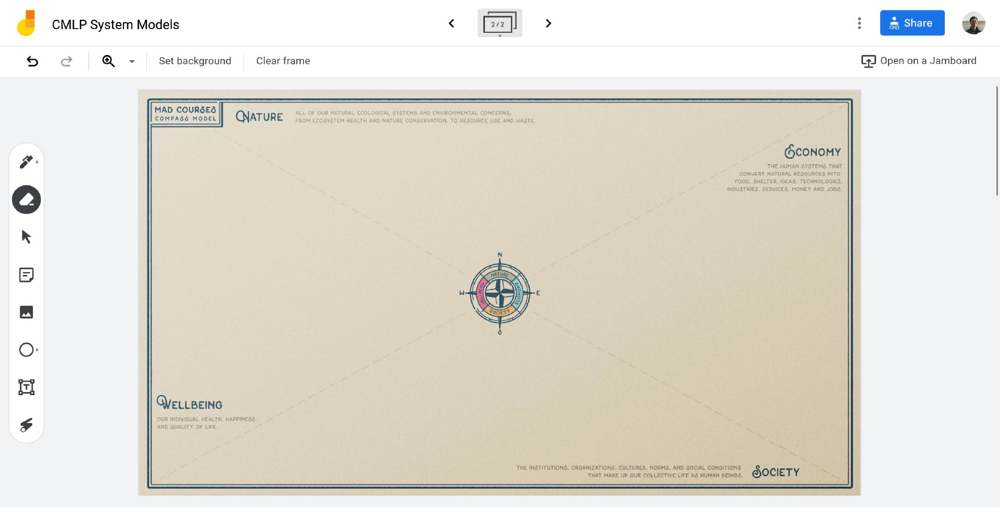
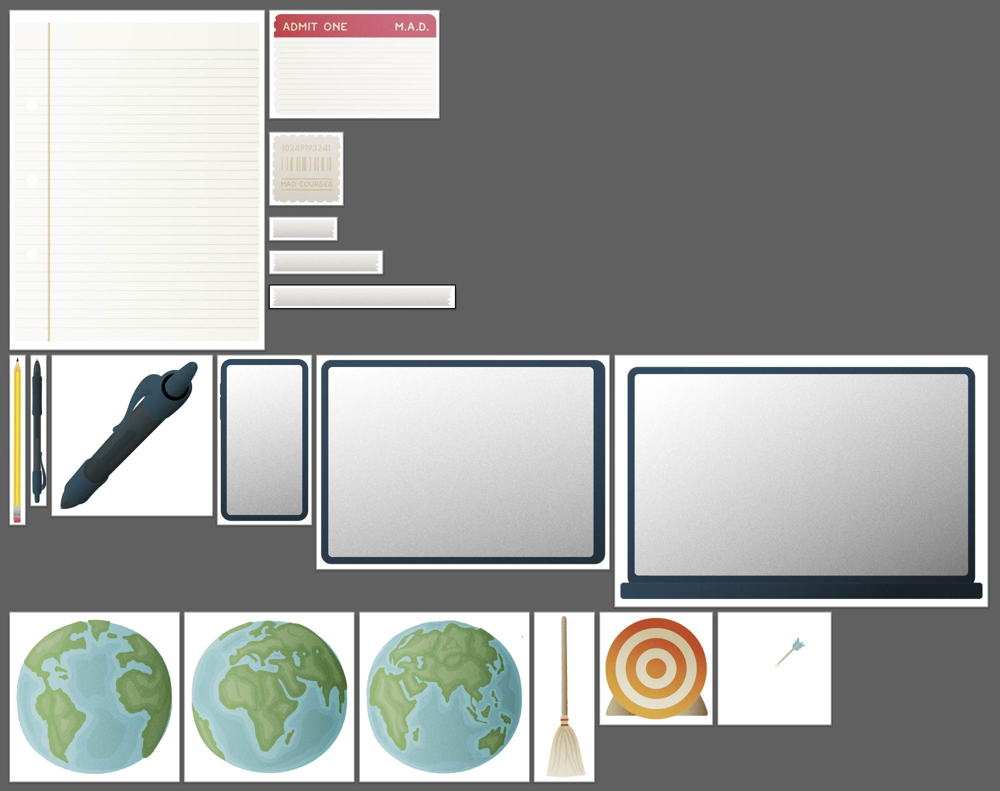
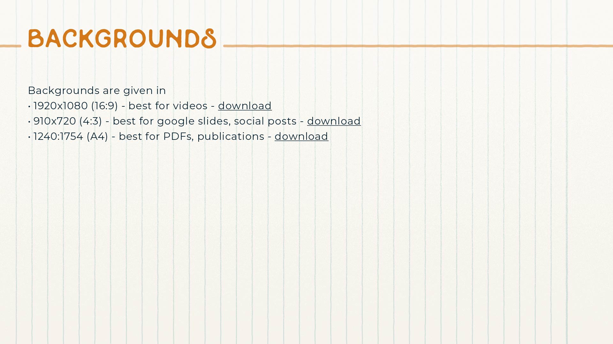
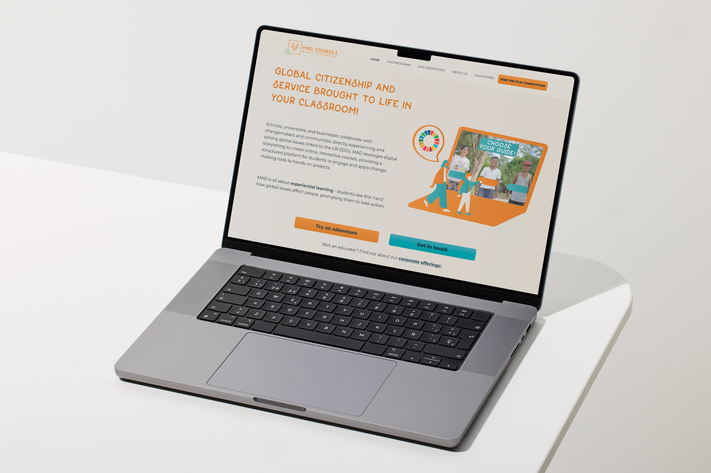
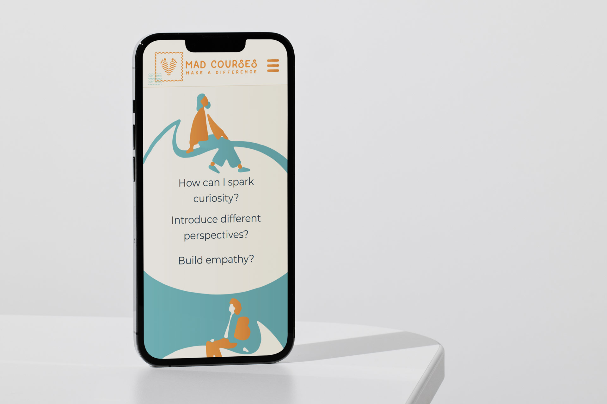

[MAD Courses](https://madcourses.com) is a social enterprise whose goal is to educate
people around the world about systems thinking, indigenous wisdom and environmental
stewardship. They work with tribes in the Philippines to create interactive &ldquo;video
adventures&rdquo;, their own brand of gamified educational videos.

## The Project

MAD needed a variety of design work to help tie together the look and feel of their
products, including a style guide and a website. The brand needed to unify the
company&rsquo;s different offerings without becoming restrictive: the interactive
courses are MAD&rsquo;s main product, but they also create worksheets, digital minigames
and activities to accompany the adventures.

> MAD uses Google sheets and Jamboards to create interactive notebooks and frameworks
> like these:

Adding to the challenge was the fact that the MAD logo and several video adventures had
already been created when I started working with the company; the brand needed to mesh with
these designs, too.

> Some of the UI elements inside a MAD video adventure used this grainy filter:

MAD is a also a small and dynamic startup, with new contractors coming in and team
members shifting roles fluidly. In my conversations with MAD I discovered that employees
often strugged to find design files from various prior contractors. I wanted the brand
guide to be functional, so MAD&rsquo;s work would not only be more beautiful, but easier
as well.

## Style Guide

I decided that the brand should lend itself to many symbolic, reuseable elements. These
icons could be pasted into all kinds of MAD products and eventually the website, too.

My first idea was to extend the MAD logo, which reminded me of the ink designs on a
passport stamp or a screen-printed t-shirt. After chatting with the team about what
designs would be most useful, created a library of simple designs in this inky style. I
wanted the designs to evoke travel, and the excitement and DIY projects.

> Inky, screen-printed icons:

These designs were versatile, but some of MAD&rsquo;s projects would require a bit more visual
intrigue than these one or two color designs offered. Like the first set, I wanted this
new set of designs to be _skeumorphic_ &mdash; a term that broadly means graphic design
emulating real objects.

This time I took that definition to the extreme, creating illustrations which mimic
actual 3D maps, boarding passes, stamps and notebook pages. I wanted to lend a real,
tactile feel to the tools MAD was creating. I hoped it would make the courses feel more
authentic, and stand out from other ed-tech companies in this space.

> Illustrations in the new skeumorphic style:

> A closeup of a presentation I made using these elements:

I was able to incorporate a grainy texture in these designs that a previous designer
included in one of the video adventures, tying that course in with the new design
language.

These two libraries combined made up a distinctive, yet adaptable design resource. I
described the best uses for these styles alongside guidelines on colors, fonts,
background colors and textures, and more in the final style guide. I was even able to
link to the various Google drive libraries inside the PDF, which made searching for all
of these new designs far easier!

> A few pages from the final guide:

## Website

The style guide also gave me direction as I tackled MAD&rsquo;s website redesign. I wanted to
combine the two styles discussed above, but I knew this would be challenging as the both
of these skeumorphic styles needed a fairly high resolution to look good. This wouldn&rsquo;t
be a problem for many of the company&rsquo;s offerings, but this brochure-style website needed to load
fast for the best search engine optimization and the best user experience.

After a lot of trial and error, I discovered that _SVG filters_ were the solution.
They&rsquo;re an uncommon but performant way to dynamically add effects to images on your
website. Using these, I developed some stylish vector graphics to explain the MAD
products.

Designing the MAD website was a long, iterative process. In the end I feel I was
able to unify the design for MAD&rsquo;s brochure website, their marketing materials and their
video adventures; making their product stand out in a competetive field, and hopefully making the team&rsquo;s lives easier in the process. ✦
