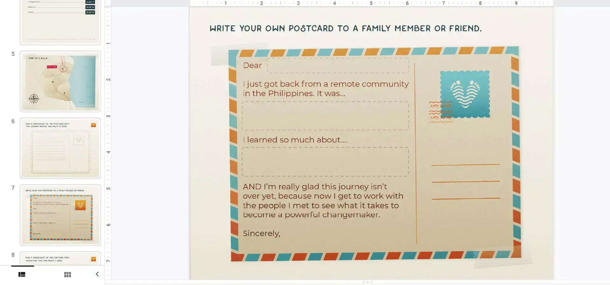
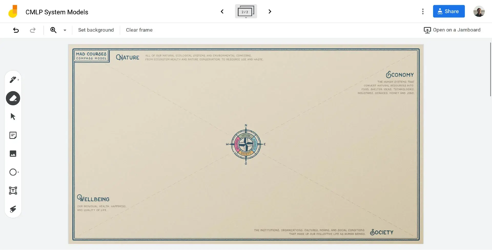
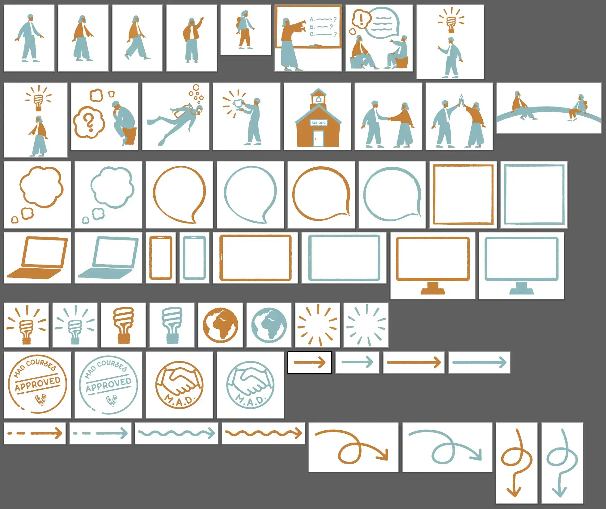
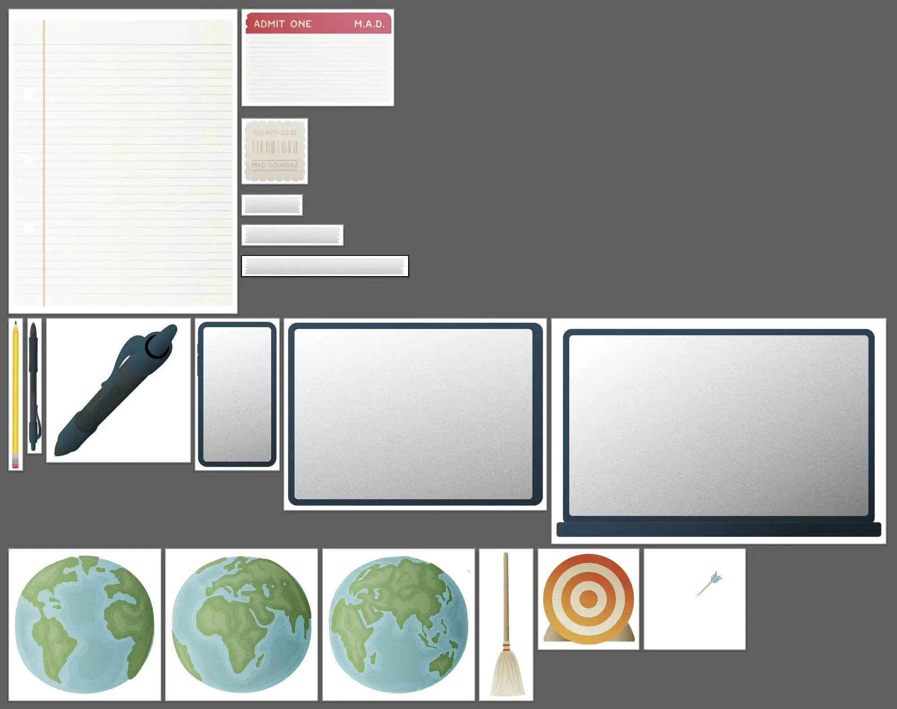
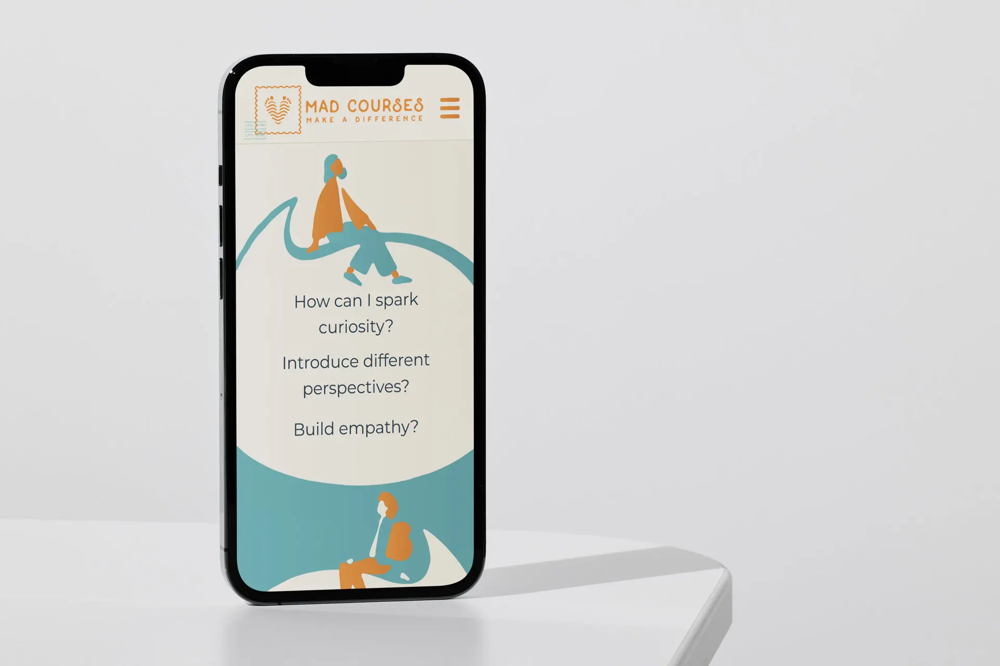

---

title: MAD Courses

hero: mad-courses-website-laptop

description: Taj DeHart's freelance work for MAD Courses

---
[MAD Courses](https://madcourses.com) is a social enterprise whose goal is to educate people around the world about systems thinking, indigenous wisdom and environmental stewardship. They work with tribes in the Philippines to create interactive “video adventures” — their own brand of gamified educational videos.
## The Project

MAD needed a variety of design work to help tie together the look and feel of their products, including a website and a brand guide. The interactive courses are MAD’s main product, but they also create worksheets, digital minigames and activities to accompany the adventures.

The brand needed to unify these offerings without becoming restrictive. Adding to the challenge was the fact that several video adventures had already been created when I started working with MAD; the brand needed to account for these designs, too.

> A digital notebook I created to accompany one of MAD’s courses:

MAD is a also a small and dynamic startup, with new contractors coming in and team members shifting roles fluidly. In my conversations with MAD I discovered that employees often struggled to find design files from various prior contractors. Often times, people not explicitly involved with design like marketers. The brand I created needed to be versatile enough to fit with these different offerings.
## Brand Guide

MAD teaches students to use _systems thinkings frameworks,_ like this worksheet

I decided that the style guide should lend itself to symbolic, reuseable elements.

I came up with the idea of emulating the ink designs of a passport stamp or a screen-printed t-shirt. This effect evoked travel to me, and the excitement and imagination of DIY projects. It was also very simple — once I had the process down, I was able to create an entire library of inky designs that were attractive but versatile.

> Illustrations in this inky, screen-printed style:

Some of MAD's projects would require more visual intrigue. My second idea was also _skeumorphic,_ a term that broadly means 2D design that emulates real 3D objects. This time I took that definition to it’s extreme, creating illustrations which mimic actual maps, boarding passes, stamps and notebook pages. I wanted to lend a tactile, realistic feel to the tools MAD was creating, to help them stand out from other education technology.

> Illustrations in the grainy style:

When combined, these two styles create a very distinctive, adaptable, beautiful design language. I described this style alongside some guidelines for using it most effectively in the style guide.
## Website

The style guide also gave me direction as I tackled MAD's website redesign. I wanted to combine the two styles discussed above, but I knew this would be challenging as the inky, sketchy style I'd crafted matched poorly with the rigidity of most website builders.

After a lot of trial and error, I discovered that [SVG filters](https://developer.mozilla.org/en-US/docs/Web/SVG/Tutorial/SVG_Filters_Tutorial) were the solution. Using these, I developed some stylish vector graphics to explain the MAD product.

These had all the flair of the MAD raster illustrations but remained highly performant. I had managed to unify the design for MAD's brochure website, their marketing and their main product. ✦