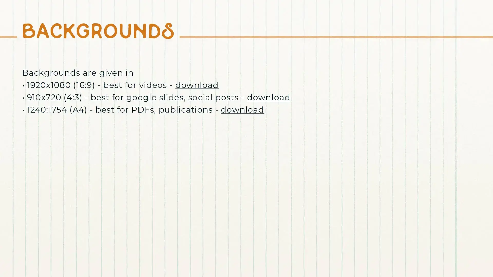
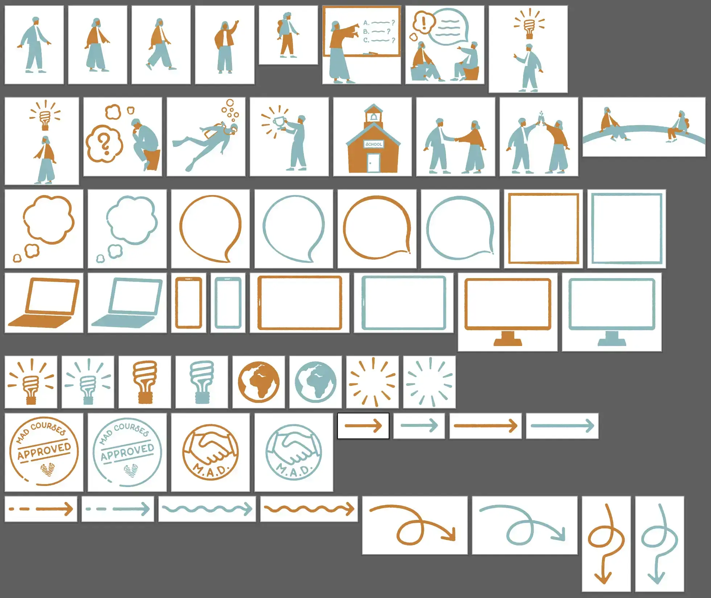

[1]: https://madcourses.com

# Mad Courses

[MAD Courses][1] is a social enterprise, founded to educate people around the
world about systems thinking, indigenous wisdom and environmental stewardship.
They work with tribes in the Philippines to create 'interactive video
adventures,' their own brand of gamified educational videos.

MAD needed a variety of design work to help tie together their product,
including a marketing website, a video course CMS, a brand guide, and much more.

## Brand guide

MAD's main product is their video course, but they knew they would need all
kinds of accompanying material, both digital and in print. And, like any
company, they also needed marketing material. I was tasked with creating a brand
that would be consistant through these different products, without feeling
restrictive to the many UX designers, motion graphics designers, and marketers.

> A few selected pages from the final style guide.

I split the task into two styles of illustration that together would cover most
of the graphics MAD needed. The first was to emulate 'ink,' like you might see
on a home-made travel scrapbook or from a passport stamp. The MAD brand font
lends itself nicely to this style.

> Illustrations in this inky, screen print style

The second was also 'skeumorphic,' a term that broadly means 2D design that
emulates real 3D objects. These illustrations mimic actual maps, boarding
passes, stamps and notebook pages, using a very attractive 3D grainy gradient
effect.

> Illustrations in the grainy style

When combined, these two styles create a very distinctive, adaptable, beautiful
design language.

> A 'logic model' I designed for MAD, which describes their business model
> visually

> Digital worksheets for 'systems thinkings frameworks,' pedagogical tools for
> solving complex problems

> A digital 'notebook' for recording thoughts during one of MAD's courses

## Website

For MAD's website, I wanted to combine the two styles discussed above. This was
both a design and a technical challenge, since I had used computational effects
that a browser would struggle to replicate.

> Images from the (draft) MAD website

After a lot of trial and error, I discovered that
[SVG filters](https://developer.mozilla.org/en-US/docs/Web/SVG/Tutorial/SVG_Filters_Tutorial) were the solution. Using these, I developed some stylish vector graphics to
explain the MAD product.

These had all the flair of the MAD raster illustrations but remained highly
performant. I had managed to unify the design for MAD's brochure website, their
marketing and their main product. ✦
