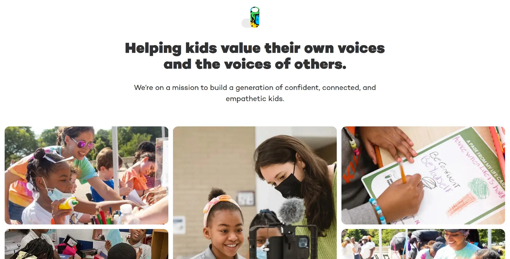
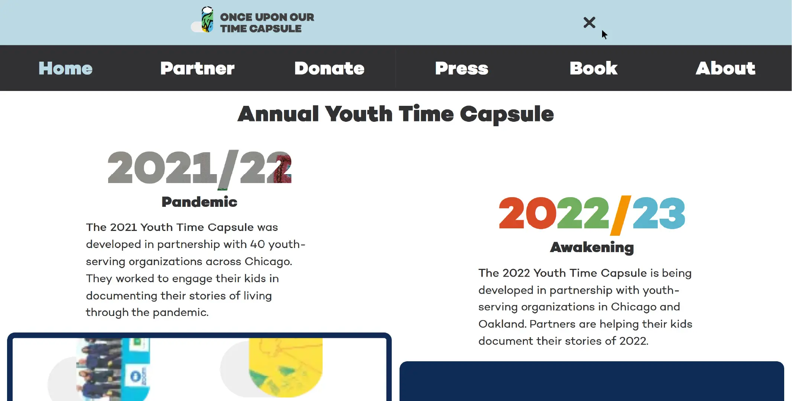
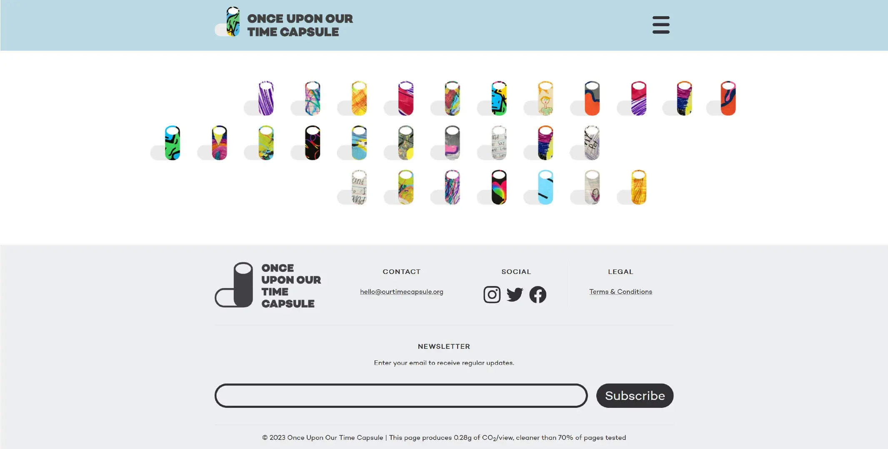
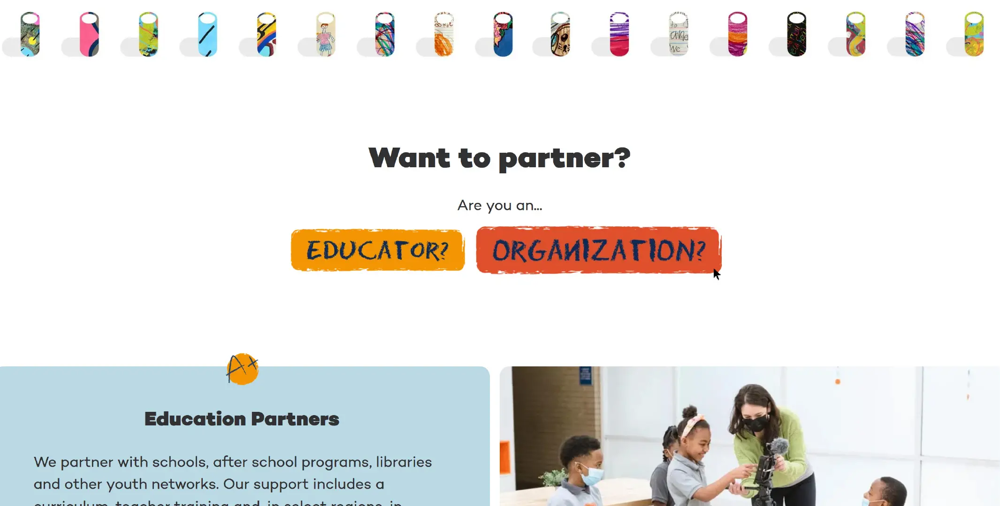
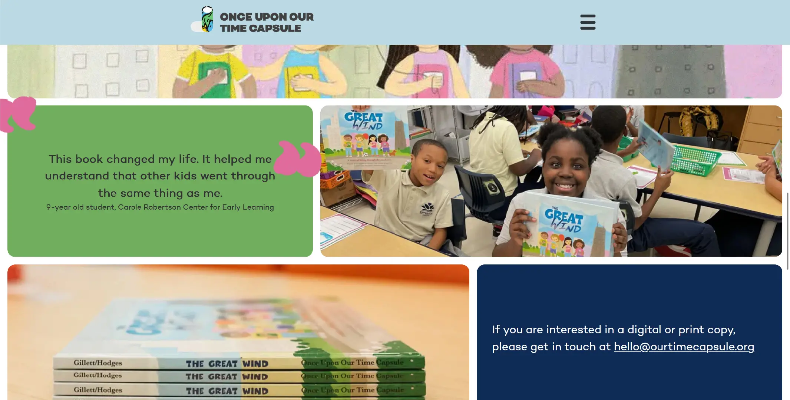
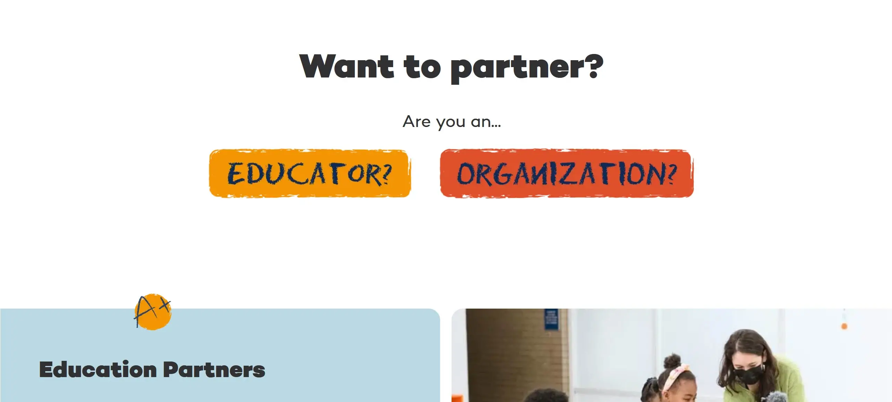
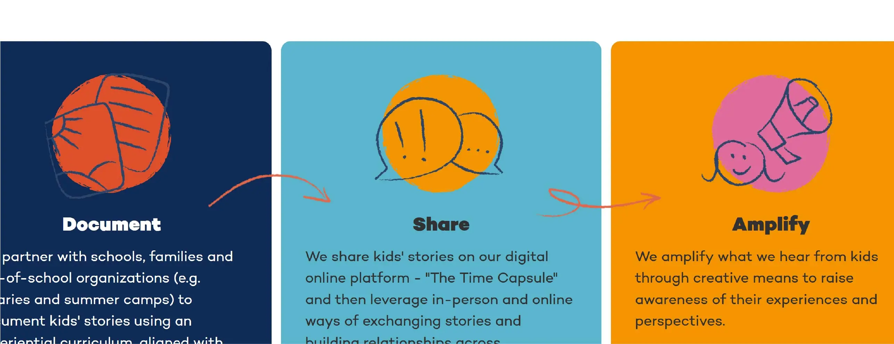
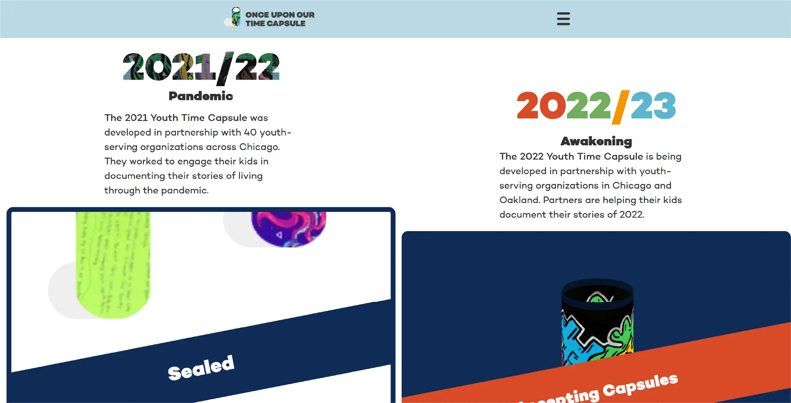
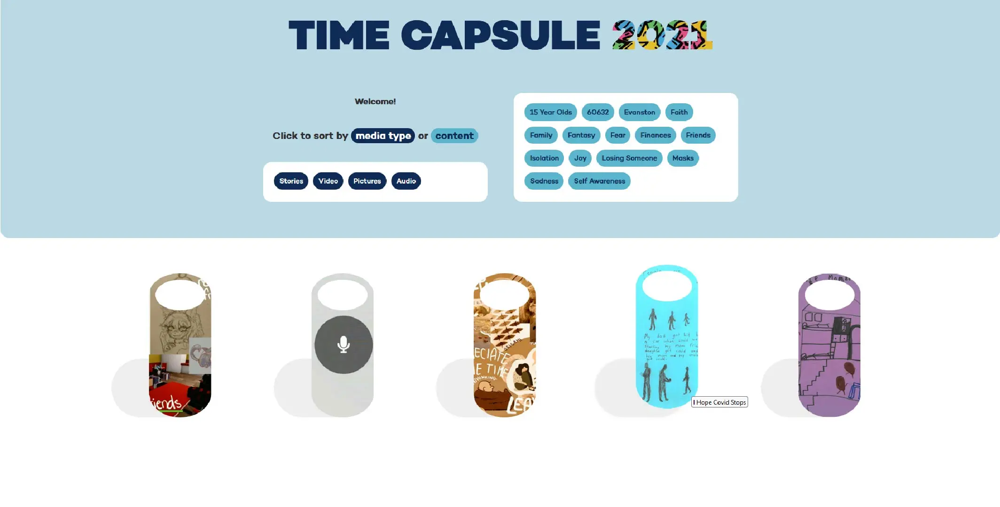
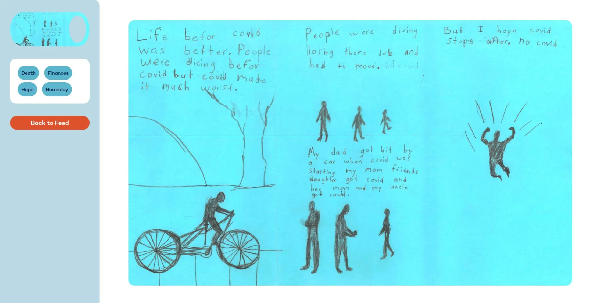

[1]: https://our-time-capsule.org
[2]: https://2021.our-time-capsule.org

# Our Time Capsule

[Once Upon Our Time Capsule][1] is a Chicago NGO dedicated to helping kids process
hardship through storytelling. Throughout 2020 and 2021, they collected thousands of
essays, artworks, and videos by kids living through the pandemic.

OTC needed an 'e-brochure' website to raise awareness of their unique mission. They also
wanted me to create an [interactive online gallery][2], where kids could read and
empathize with their peers' stories.

## Brochure Site

OTC is all about putting the spotlight back on kids, so my design for the informational
website relies heavily on the organization's wonderful photography of kids participating
in OTC events.

These images start hidden, then slide into view as the user scrolls. This adds some
visual intrigue, but it also gives these pictures slightly more time to load - important
in a site with so many images.

> Photographs of the OTC picture book integrated with info and testimonials

These big animated image mosaics make up the bulk of the site, so I wanted to offset
this with some illustrations. I was inspired by the OTC picture book, which uses kid's
actual artwork alongside professional illustrations.

> I created custom buttons and icons for the site that mimic kid's artwork

I had probably the most fun designing these previews for the capsule databases, both a
2D and 3D animated capsule behind ticker tape. They're intriguing, without giving too
much away.

## Database Site

For the time time capsule gallery, I had to resist the urge to imitate a video game or
social media app. OTC wanted to treat Chicago's children like equals, with stories to
tell.

I kept the interface extremely minimal, so as to draw the most attention to the kid's
artwork. Kids can filter the capsules by topic, and

> The interface for the 2021 digital time capsule

> An individual time capsule

The login page, however, was an opportunity to create anticipation and excitement. This
is what the kids are presented with after waiting up to _five years_ to see their
artwork.

> The animation that plays when the capsule is opened for the first time

<video width="720px" alt="Video of the digital time capsule opening" controls><source src="../videos/our-time-capsule-2021-opening.webm" /><source src="../videos/our-time-capsule-2021-opening.mp4" /></video>

I'm quite proud of the resulting design - it balances playful excitement with some of
the gravitas of opening a real-life time capsule. ✦
